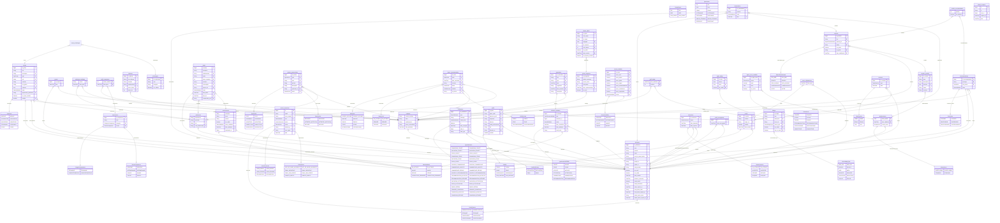

```mermaid
erDiagram

        RoleUtilisateur {
            ADMINISTRATEUR ADMINISTRATEUR
ETUDIANT ETUDIANT
PROFESSEUR PROFESSEUR
PROFESSIONNEL PROFESSIONNEL
        }
    


        TypeNotification {
            SOUMISSION_PROJET SOUMISSION_PROJET
VALIDATION_PROJET VALIDATION_PROJET
REFUS_PROJET REFUS_PROJET
SOUMISSION_STAGE SOUMISSION_STAGE
VALIDATION_STAGE VALIDATION_STAGE
REFUS_STAGE REFUS_STAGE
NOUVEAU_COMMENTAIRE NOUVEAU_COMMENTAIRE
COMMENTAIRE_ACCEPTE COMMENTAIRE_ACCEPTE
COMMENTAIRE_REFUSE COMMENTAIRE_REFUSE
NOUVELLE_RECOMMANDATION NOUVELLE_RECOMMANDATION
RECOMMANDATION_ACCEPTEE RECOMMANDATION_ACCEPTEE
RECOMMANDATION_REFUSEE RECOMMANDATION_REFUSEE
VALIDATION_ATTESTATION VALIDATION_ATTESTATION
REFUS_ATTESTATION REFUS_ATTESTATION
BADGE_OBTENU BADGE_OBTENU
DEMANDE_CONNEXION DEMANDE_CONNEXION
CONNEXION_ACCEPTEE CONNEXION_ACCEPTEE
CONNEXION_REFUSEE CONNEXION_REFUSEE
        }
    


        Visibilite {
            PUBLIC PUBLIC
PRIVE PRIVE
ENSEIGNANTS ENSEIGNANTS
LIEN_PARTAGE LIEN_PARTAGE
        }
    


        CategorieCompetence {
            TECHNIQUE TECHNIQUE
COMPORTEMENTALE COMPORTEMENTALE
        }
    


        NiveauCompetence {
            DEBUTANT DEBUTANT
INTERMEDIAIRE INTERMEDIAIRE
AVANCE AVANCE
EXPERT EXPERT
        }
    


        TypeProjet {
            MODULE MODULE
INTEGRATION INTEGRATION
HACKATHON HACKATHON
PERSONNEL PERSONNEL
STAGE STAGE
        }
    


        StatutValidation {
            EN_ATTENTE EN_ATTENTE
VALIDE VALIDE
REFUSE REFUSE
CORRECTION_DEMANDEE CORRECTION_DEMANDEE
        }
    


        CanalNotification {
            APPLICATION APPLICATION
EMAIL EMAIL
        }
    


        TypeActivite {
            CLUB CLUB
EVENEMENT EVENEMENT
HACKATHON HACKATHON
COMPETITION COMPETITION
ASSOCIATION ASSOCIATION
        }
    


        StatutActivite {
            DECLAREE DECLAREE
ATTESTEE_INSTITUTION ATTESTEE_INSTITUTION
REFUSEE REFUSEE
        }
    


        MotifLettre {
            DOUBLE_DIPLOME DOUBLE_DIPLOME
MASTER MASTER
EMPLOI EMPLOI
STAGE STAGE
INTERNATIONAL INTERNATIONAL
        }
    


        StatutLettre {
            EN_ATTENTE EN_ATTENTE
REDIGEE REDIGEE
REFUSEE REFUSEE
        }
    


        VisibiliteLettre {
            PUBLIC PUBLIC
PRIVE PRIVE
TELECHARGEABLE TELECHARGEABLE
        }
    


        TypeElementValidable {
            PROJET PROJET
STAGE STAGE
ACTIVITE ACTIVITE
ATTESTATION ATTESTATION
COMMENTAIRE COMMENTAIRE
RECOMMANDATION RECOMMANDATION
        }
    


        ObjectifProfessionnel {
            DEV_WEB DEV_WEB
DEVOPS DEVOPS
DATA_SCIENCE DATA_SCIENCE
CYBERSECURITE CYBERSECURITE
AUTRE AUTRE
        }
    


        NiveauCredibilite {
            DEBUTANT DEBUTANT
INTERMEDIAIRE INTERMEDIAIRE
AVANCE AVANCE
EXPERT EXPERT
        }
    


        RoleAuteur {
            ETUDIANT ETUDIANT
PROFESSEUR PROFESSEUR
PROFESSIONNEL PROFESSIONNEL
        }
    


        FormatExport {
            PDF PDF
WEB WEB
LIEN_PUBLIC LIEN_PUBLIC
        }
    


        TypeContrat {
            CDI CDI
CDD CDD
STAGE STAGE
ALTERNANCE ALTERNANCE
FREELANCE FREELANCE
EMPLOI_ETUDIANT EMPLOI_ETUDIANT
BENEVOLAT BENEVOLAT
        }
    


        CritereBadgeType {
            WEB_DEV WEB_DEV
DEVOPS DEVOPS
DATA DATA
SECURITE SECURITE
HACKATHON HACKATHON
COLLAB COLLAB
        }
    


        CritereScore {
            PROJETS PROJETS
GITHUB GITHUB
STAGES STAGES
RECOMMANDATIONS RECOMMANDATIONS
CERTIFICATIONS CERTIFICATIONS
COMPLETUDE COMPLETUDE
        }
    


        TypeReaction {
            JAIME JAIME
BRAVO BRAVO
LIKE LIKE
        }
    


        StatutConnexion {
            EN_ATTENTE EN_ATTENTE
ACCEPTEE ACCEPTEE
REFUSEE REFUSEE
BLOQUEE BLOQUEE
        }
    


        NiveauAcces {
            SUPER_ADMIN SUPER_ADMIN
STANDARD STANDARD
        }
    


        ActionConnexion {
            LOGIN_REUSSI LOGIN_REUSSI
LOGIN_ECHOUE LOGIN_ECHOUE
DECONNEXION DECONNEXION
        }
    


        RaisonEchec {
            MOT_DE_PASSE_INCORRECT MOT_DE_PASSE_INCORRECT
EMAIL_INEXISTANT EMAIL_INEXISTANT
EMAIL_NON_VERIFIE EMAIL_NON_VERIFIE
COMPTE_INACTIF COMPTE_INACTIF
        }
    
  "reposts" {
    BigInt id_repost "🗝️"
    DateTime date 
    }
  

  "journal_connexions" {
    BigInt id "🗝️"
    String email "❓"
    String nom_complet "❓"
    RoleUtilisateur role "❓"
    ActionConnexion action 
    RaisonEchec raison "❓"
    String adresse_ip "❓"
    String user_agent "❓"
    DateTime date 
    }
  

  "utilisateurs" {
    BigInt id_utilisateur "🗝️"
    String nom 
    String prenom 
    String email 
    String mot_de_passe_hashe "❓"
    RoleUtilisateur role 
    String google_id "❓"
    String github_id "❓"
    String auth_provider 
    Boolean est_actif 
    Boolean est_valide 
    DateTime date_creation 
    DateTime derniere_connexion "❓"
    Boolean email_verifie 
    String email_verification "❓"
    DateTime token_expires_at "❓"
    String reset_token_hash "❓"
    DateTime reset_token_expires_at "❓"
    String admin_action_token "❓"
    DateTime admin_action_expires_at "❓"
    }
  

  "etudiants" {
    String numero_etudiant "❓"
    String filiere "❓"
    String etablissement "❓"
    String annee_universitaire "❓"
    DateTime date_naissance "❓"
    }
  

  "professeurs" {
    String departement "❓"
    String specialite "❓"
    String titre "❓"
    String code_administratif "❓"
    }
  

  "professeur_etudiants" {
    String source "❓"
    DateTime date_ajout 
    }
  

  "administrateurs" {
    Json droits_admin "❓"
    DateTime date_validation "❓"
    NiveauAcces niveau_acces 
    }
  

  "professionnels" {
    String entreprise 
    String poste 
    String secteur "❓"
    Boolean est_valide 
    StatutValidation statut_validation 
    DateTime date_validation "❓"
    String justificatifs_url "❓"
    }
  

  "notifications" {
    BigInt id_notification "🗝️"
    TypeNotification type 
    String message "❓"
    CanalNotification canal_envoi 
    Boolean lu 
    DateTime date_reception "❓"
    BigInt cible_id "❓"
    String cible_type "❓"
    }
  

  "profils" {
    BigInt id_profil "🗝️"
    String photo_profil "❓"
    String banniere_profil "❓"
    String telephone "❓"
    String adresse "❓"
    String email_professionnel "❓"
    String bio "❓"
    String linkedin_url "❓"
    Visibilite visibilite 
    }
  

  "competences" {
    BigInt id_competence "🗝️"
    String nom 
    CategorieCompetence categorie "❓"
    NiveauCompetence niveau "❓"
    }
  

  "profil_competence" {
    Int niveau_maitrise "❓"
    DateTime date_ajout "❓"
    }
  

  "diplomes" {
    BigInt id_diplome "🗝️"
    String titre_diplome 
    String domaine "❓"
    String etablissement "❓"
    Int annee_debut "❓"
    Int annee_fin "❓"
    }
  

  "projets" {
    BigInt id_projet "🗝️"
    String titre 
    String description "❓"
    TypeProjet type "❓"
    String role "❓"
    String resultats "❓"
    String lien_github "❓"
    Json captures "❓"
    StatutValidation statut 
    String appreciation_professeur "❓"
    Boolean est_dans_portfolio 
    Visibilite visibilite "❓"
    }
  

  "technologies" {
    BigInt id_technologie "🗝️"
    String nom 
    String categorie "❓"
    Boolean est_validee 
    }
  

  "projet_technologie" {

    }
  

  "stages" {
    BigInt id_stage "🗝️"
    String entreprise 
    String etablissement "❓"
    String poste "❓"
    Int duree_semaines "❓"
    String missions "❓"
    String technologies "❓"
    String rapport_url "❓"
    StatutValidation statut 
    DateTime date_debut "❓"
    DateTime date_fin "❓"
    String commentaire_prof "❓"
    }
  

  "activites_parascolaires" {
    BigInt id_activite "🗝️"
    TypeActivite type "❓"
    String nom "❓"
    String periode "❓"
    String description "❓"
    String justificatif_url "❓"
    StatutActivite statut "❓"
    }
  

  "lettres_recommandation" {
    BigInt id_lettre "🗝️"
    MotifLettre motif "❓"
    DateTime date_souhaitee "❓"
    String contenu "❓"
    StatutLettre statut "❓"
    VisibiliteLettre visibilite "❓"
    String url_fichier "❓"
    }
  

  "elements_validables" {
    BigInt id_element "🗝️"
    TypeElementValidable type 
    BigInt reference_id 
    StatutValidation statut 
    DateTime date_soumission "❓"
    DateTime date_validation "❓"
    String motif_refus "❓"
    }
  

  "attestations" {
    BigInt id_attestation "🗝️"
    String titre "❓"
    String type "❓"
    DateTime date "❓"
    String organisme "❓"
    DateTime date_retention "❓"
    String description "❓"
    }
  

  "portfolios" {
    BigInt id_portfolio "🗝️"
    String titre "❓"
    ObjectifProfessionnel objectif_pro "❓"
    String theme "❓"
    Boolean est_public 
    String url_public "❓"
    DateTime date_modification "❓"
    }
  

  "modeles_portfolio" {
    BigInt id_modele "🗝️"
    String nom 
    String description "❓"
    Json structure "❓"
    String theme "❓"
    String sections "❓"
    }
  

  "scores_credibilite" {
    BigInt id_score "🗝️"
    Decimal score_total "❓"
    Decimal score_projets "❓"
    Decimal score_github "❓"
    Decimal score_stages "❓"
    Decimal score_recommandations "❓"
    Decimal score_certifications "❓"
    Decimal score_completude "❓"
    NiveauCredibilite niveau "❓"
    }
  

  "commentaires" {
    BigInt id_commentaire "🗝️"
    String contenu 
    StatutValidation statut 
    DateTime date "❓"
    }
  

  "recommandations" {
    BigInt id_recommandation "🗝️"
    String message "❓"
    RoleAuteur role_auteur "❓"
    StatutValidation statut 
    }
  

  "portfolio_recommandation" {
    Int position "❓"
    Boolean est_affichee 
    }
  

  "badges" {
    BigInt id_badge "🗝️"
    String nom 
    String description "❓"
    String icone_url "❓"
    CritereBadgeType critere_type "❓"
    Boolean est_visible "❓"
    Boolean mis_en_avant "❓"
    }
  

  "profil_badge" {
    DateTime date_attribution "❓"
    Int position "❓"
    }
  

  "regles_badge" {
    BigInt id_regle "🗝️"
    Json criteres 
    Json seuils "❓"
    Boolean est_valide "❓"
    }
  

  "regles_score_credibilite" {
    BigInt id_regle_score "🗝️"
    CritereScore critere "❓"
    Decimal poids "❓"
    Json seuil "❓"
    Boolean est_active 
    }
  

  "github_integration" {
    BigInt id_integration "🗝️"
    String github_username 
    String access_token "❓"
    Int total_depot 
    DateTime date_synchronisation "❓"
    Boolean est_actif 
    }
  

  "depots_github" {
    BigInt id_depot "🗝️"
    String nom_depot 
    String url_depot 
    Json langages "❓"
    Int nb_commits "❓"
    Int total_depots "❓"
    Boolean est_public "❓"
    DateTime date_creation "❓"
    Boolean est_importe_portfolio 
    }
  

  "postes" {
    BigInt id_poste "🗝️"
    String contenu 
    String image_url "❓"
    Visibilite visibilite 
    DateTime date_creation 
    }
  

  "poste_collaborateurs" {
    DateTime date_ajout 
    }
  

  "reactions" {
    BigInt id_reaction "🗝️"
    TypeReaction type 
    DateTime date 
    }
  

  "tokens_revoques" {
    BigInt id "🗝️"
    String jti 
    BigInt user_id "❓"
    DateTime expires_at 
    DateTime date 
    }
  

  "connexions" {
    BigInt id_connexion "🗝️"
    StatutConnexion statut 
    DateTime date_demande 
    DateTime date_reponse "❓"
    }
  

  "profils_sauvegardes" {
    BigInt id "🗝️"
    DateTime date_sauvegarde 
    }
  
    "reposts" }o--|| utilisateurs : "auteur"
    "reposts" }o--|| postes : "publication"
    "journal_connexions" |o--|o "RoleUtilisateur" : "enum:role"
    "journal_connexions" |o--|| "ActionConnexion" : "enum:action"
    "journal_connexions" |o--|o "RaisonEchec" : "enum:raison"
    "journal_connexions" }o--|o utilisateurs : "utilisateur"
    "utilisateurs" |o--|| "RoleUtilisateur" : "enum:role"
    "etudiants" |o--|| utilisateurs : "utilisateur"
    "professeurs" |o--|| utilisateurs : "utilisateur"
    "professeur_etudiants" }o--|| professeurs : "professeur"
    "professeur_etudiants" }o--|| etudiants : "etudiant"
    "administrateurs" |o--|| "NiveauAcces" : "enum:niveau_acces"
    "administrateurs" |o--|| utilisateurs : "utilisateur"
    "professionnels" |o--|| "StatutValidation" : "enum:statut_validation"
    "professionnels" |o--|| utilisateurs : "utilisateur"
    "notifications" |o--|| "TypeNotification" : "enum:type"
    "notifications" |o--|| "CanalNotification" : "enum:canal_envoi"
    "notifications" }o--|| utilisateurs : "utilisateur"
    "profils" |o--|| "Visibilite" : "enum:visibilite"
    "profils" |o--|| utilisateurs : "utilisateur"
    "competences" |o--|o "CategorieCompetence" : "enum:categorie"
    "competences" |o--|o "NiveauCompetence" : "enum:niveau"
    "profil_competence" }o--|| etudiants : "etudiant"
    "profil_competence" }o--|| competences : "competence"
    "diplomes" }o--|| etudiants : "etudiant"
    "projets" |o--|o "TypeProjet" : "enum:type"
    "projets" |o--|| "StatutValidation" : "enum:statut"
    "projets" |o--|o "Visibilite" : "enum:visibilite"
    "projets" }o--|| etudiants : "etudiant"
    "projets" }o--|o professeurs : "professeur"
    "projet_technologie" }o--|| projets : "projet"
    "projet_technologie" }o--|| technologies : "technologie"
    "stages" |o--|| "StatutValidation" : "enum:statut"
    "stages" }o--|| etudiants : "etudiant"
    "stages" }o--|o professeurs : "encadrant"
    "stages" }o--|o professionnels : "professionnel"
    "activites_parascolaires" |o--|o "TypeActivite" : "enum:type"
    "activites_parascolaires" |o--|o "StatutActivite" : "enum:statut"
    "activites_parascolaires" }o--|| etudiants : "etudiant"
    "activites_parascolaires" }o--|o professeurs : "validateur"
    "lettres_recommandation" |o--|o "MotifLettre" : "enum:motif"
    "lettres_recommandation" |o--|o "StatutLettre" : "enum:statut"
    "lettres_recommandation" |o--|o "VisibiliteLettre" : "enum:visibilite"
    "lettres_recommandation" }o--|| etudiants : "etudiant"
    "lettres_recommandation" }o--|o professeurs : "professeur"
    "elements_validables" |o--|| "TypeElementValidable" : "enum:type"
    "elements_validables" |o--|| "StatutValidation" : "enum:statut"
    "elements_validables" }o--|o utilisateurs : "validateur"
    "attestations" |o--|| elements_validables : "element"
    "attestations" }o--|o etudiants : "etudiant"
    "portfolios" |o--|o "ObjectifProfessionnel" : "enum:objectif_pro"
    "portfolios" |o--|| etudiants : "etudiant"
    "portfolios" }o--|o modeles_portfolio : "modele"
    "modeles_portfolio" }o--|o administrateurs : "administrateur"
    "scores_credibilite" |o--|o "NiveauCredibilite" : "enum:niveau"
    "scores_credibilite" |o--|| etudiants : "etudiant"
    "commentaires" |o--|| "StatutValidation" : "enum:statut"
    "commentaires" }o--|| utilisateurs : "auteur"
    "commentaires" }o--|o portfolios : "portfolio"
    "commentaires" }o--|o postes : "publication"
    "recommandations" |o--|o "RoleAuteur" : "enum:role_auteur"
    "recommandations" |o--|| "StatutValidation" : "enum:statut"
    "recommandations" }o--|| utilisateurs : "auteur"
    "recommandations" }o--|| etudiants : "etudiant_cible"
    "portfolio_recommandation" }o--|| portfolios : "portfolio"
    "portfolio_recommandation" }o--|| recommandations : "recommandation"
    "badges" |o--|o "CritereBadgeType" : "enum:critere_type"
    "profil_badge" }o--|| etudiants : "etudiant"
    "profil_badge" }o--|| badges : "badge"
    "regles_badge" }o--|| badges : "badge"
    "regles_score_credibilite" |o--|o "CritereScore" : "enum:critere"
    "regles_score_credibilite" }o--|o administrateurs : "administrateur"
    "github_integration" |o--|| etudiants : "etudiant"
    "depots_github" }o--|| github_integration : "integration"
    "postes" |o--|| "Visibilite" : "enum:visibilite"
    "postes" }o--|| utilisateurs : "auteur"
    "poste_collaborateurs" }o--|| postes : "poste"
    "poste_collaborateurs" }o--|| utilisateurs : "utilisateur"
    "reactions" |o--|| "TypeReaction" : "enum:type"
    "reactions" }o--|| utilisateurs : "auteur"
    "reactions" }o--|| postes : "publication"
    "connexions" |o--|| "StatutConnexion" : "enum:statut"
    "connexions" }o--|| utilisateurs : "demandeur"
    "connexions" }o--|| utilisateurs : "destinataire"
    "profils_sauvegardes" }o--|| utilisateurs : "sauvegardeur"
    "profils_sauvegardes" }o--|| utilisateurs : "etudiant"
```
